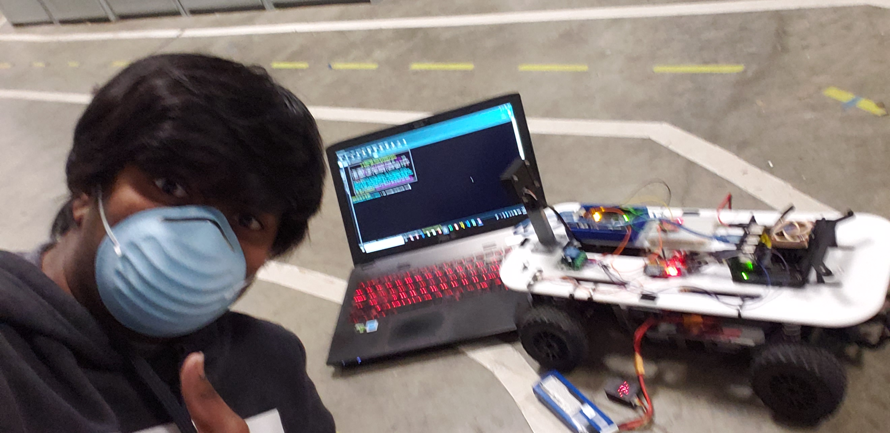

# Welcome to Jacinth Gudetti's Test Pages
###### I'm just going to talk about random stuff

The dream is to become an EV/Hybrid engineer at a major car maker working on the next generation of high performance sports cars and/or racecars. In my research I believe the true long term fuel alternative is hydrogen, here is why I believe hydrogen fuel cell cars `FCVs` are the future:

### Environmental Impact

Battery Electric Vehicles `BEVs` have a number of issues when it comes to environmental impact:

1. Intensive mining is required to harvest battery materials
2. Batteries themselves are heavy to transport
3. Battery disposal is difficult

Although FCVs do require platinum to line the inside of the fuel cell, there is successful development to _remove_ platinum from the equation.

This [article](https://www.climatecolab.org/contests/2016/transportation/c/proposal/1331641) explains the benefits of FCVs very well.


The other advantage of hydrogen is that gas powered vehicles can run on hydrogen as well with modification to the fuel system! Mazda in fact modified a RX8 to run 
on _both_ hydrogen ***AND*** gasoline. Here is a picture:


Now it is worth mentioning that Elon Musk has been quoted with tweeting:

>Fuel cells = fool sells

I do believe he is wrong because although fuel cells are less efficient they are more versatile and can power both ICE cars and EVs as discussed earlier. The fact is that widescale EV production will be very difficult to sell everyone on however by offering gasoline owners an alternative to keep their gas cars running and produce little to no emissions is a very real step forward in the long term.


# Why Python is great fro machine learning versus C++

Python is a very easy to use programming language that is very flexible and high level that is still fast enough for most ML and AI applications.

In fact, [57%](https://towardsdatascience.com/what-is-the-best-programming-language-for-machine-learning-a745c156d6b7) of data scientists and machine learning developers use Python for their applications.

Although some argue that Python tends to be a slow language, in my experience, it is plenty fast enough for self driving applications and machine learning training. The real limitation appears to be computing power on the hardware side. During my autonomous vehicles project, a training model that would take my Nvidia GTX 960m equipped laptop around 2 hours to compute a supercomputer with Nvidia P100 nodes would take around 4-5 minutes.


Although C++ is a much faster language, Pythong has a number of advantages:
1. Python is simpler to read
 - It is easier for non coders to understand the logic flow of your code.

Look at the code below for the Fibonacci sequence. For a non coder, Python is easier to explain

Python:
```markdown
def F(n):  if n == 0:
   return 0  if n == 1:
   return 1  else:
   return F(n-1) + F(n-2)
```
C++:
```markdwown
int F(int n) {
 if(n == 0) {
  return 0;
 }
 if(n == 1) {
  return 1;
 }
 else {
  return F(n-1) + F(n-2);
 }
}
```
[Click here](docs/CONTRIBUTING.md) for the file for the Python code above

Credit to [freeCodeCamp](https://www.freecodecamp.org/news/the-fibonacci-sequence-in-5-different-programming-languages-1c6514c749e5/) for the original code

2. Python is lightweight
 - Easier to develop on for the coder

While both languages have their issues, C++ is a lower end programming language and thus different compilers have different optimizations and thus C++ may not behave the same way on one machine as it does on another if that is not taken into account.

Not to mention, optimisng extensions like [Cython](https://cython.org/) can convert Python to a statically type language and thus make Python compile and run at the same time as C++. So there is no real need for C++ in most cases.
 
3. Python has more development done for machine learning

 - Historically, more ML developers have coded with Python so from an engineering perspective, even if C++ is faster, the amount of support and optimization done with Python outweigh C++'s benefits most of the time

As Timo Rohner, a senior ML engineer says:
> most models published in papers are publicly available in the form of implementations in Python.
