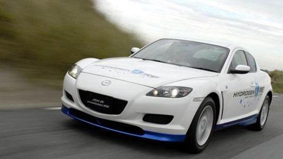

## Welcome to Jacinth Gudetti's GitHub Pages

The dream is to become an EV/Hybrid engineer at a major car maker working on the next generation of high performance sports cars and/or racecars. In my research I believe the true long term fuel alternative is hydrogen, here is why I believe hydrogen fuel cell cars (FCVs) are the future:

### Environmental Impact

Battery Electric Vehicles (BEVs) have a number of issues when it comes to environmental impact:

1. Intensive mining is required to harvest battery materials
2. Batteries themselves are heavy to transport
3. Battery disposal is difficult

Although FCVs do require platinum to line the inside of the fuel cell, there is successful development to _remove_ platinum from the equation.

This [article](https://www.climatecolab.org/contests/2016/transportation/c/proposal/1331641) explains the benefits of FCVs very well.

**Bold** and _Italic_ and `Code` text

[Link](url) and 

```markdown
```

For more details see [GitHub Flavored Markdown](https://guides.github.com/features/mastering-markdown/).

### Jekyll Themes

Your Pages site will use the layout and styles from the Jekyll theme you have selected in your [repository settings](https://github.com/jdawg86/jdawg86.github.io/settings). The name of this theme is saved in the Jekyll `_config.yml` configuration file.

### Support or Contact

Having trouble with Pages? Check out our [documentation](https://docs.github.com/categories/github-pages-basics/) or [contact support](https://github.com/contact) and we’ll help you sort it out.
